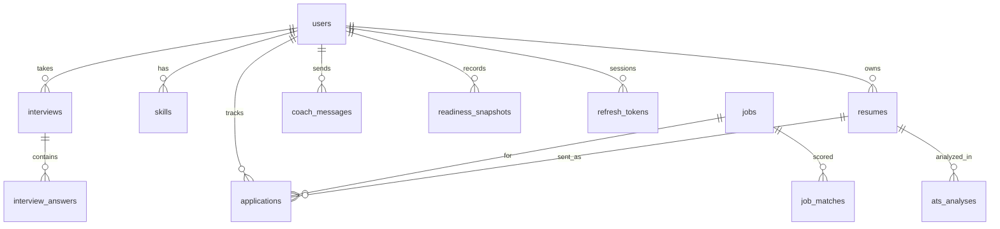

# @careerforge/database

The PostgreSQL layer for CareerForge as its own package: schema, migrations, client factory, seed and verification. It knows nothing about Express, the API or the frontend, and never reads `process.env` (only the CLI scripts do).

```text
database/
├── package.json  tsconfig.json  drizzle.config.ts  .env.example
├── migrations/           generated SQL + meta. Commit it. Never edit an applied file
├── src/
│   ├── index.ts          public API: createDatabase, every table, resumeContent + types
│   ├── client.ts         createDatabase({ connectionString }) → { db, pool }
│   ├── content.ts        zod schema + types for resumes.content (shared with the API)
│   ├── schema/
│   │   ├── _shared.ts    pk(), createdAt(), updatedAt()
│   │   ├── _enums.ts     interview_status, application_stage, coach_role, job_level, skill_source
│   │   ├── users.ts      users, refresh_tokens, password_reset_tokens, owner() FK helper
│   │   ├── resumes.ts    resumes, ats_analyses
│   │   ├── skills.ts  jobs.ts  interviews.ts  applications.ts  coach.ts  progress.ts  audit.ts
│   │   ├── relations.ts  typed joins for db.query.*
│   │   └── index.ts
│   └── cli/              env.ts, migrate.ts, seed.ts (read DATABASE_URL)
└── test/verify.mjs       applies migrations to in-memory Postgres and checks the rules
```

## Use it
**Standalone** (in this folder): `cp .env.example .env`, set `DATABASE_URL`, then `npm install && npm run migrate`. Optional dev data: `npm run seed`. Browse data: `npm run studio`.

**From the API** (npm workspace, see the root `package.json`):
```ts
import { createDatabase, resumes } from "@careerforge/database";
export const { db, pool } = createDatabase({ connectionString: process.env.DATABASE_URL! });
```
The package must be built (`npm run build -w database`) before the backend runs; the root `postinstall` does this. After changing the schema, rebuild it. Keep one copy of `drizzle-orm` in the workspace (npm hoists it) so query helpers like `eq` and `and` share types with the tables.

## Commands
| Command | What it does |
|---|---|
| `npm run generate` | Diff schema → new SQL file in `migrations/`. Read it before committing |
| `npm run migrate` | Apply pending migrations (same command in CI and production) |
| `npm run seed` | Demo user + 8 fictional jobs. Refuses to run when `NODE_ENV=production` |
| `npm run verify` | Runs all migrations on in-memory Postgres (PGlite) and asserts constraints and cascades. No server needed |
| `npm run build` | Compile to `dist/` for consumers |

## Model (16 tables)

`users`, `refresh_tokens`, `password_reset_tokens`, `resumes`, `ats_analyses`, `skills`, `jobs`, `job_matches`, `saved_jobs`, `interviews`, `interview_answers`, `applications`, `coach_messages`, `learning_plan_steps`, `readiness_snapshots`, `audit_log`.

## Conventions
- uuid primary keys, `timestamptz` everywhere, snake_case in SQL, camelCase in TypeScript.
- **Every user-owned table has `user_id ... ON DELETE CASCADE`** (`owner()`), so deleting an account is one statement.
- Links that should outlive the other row use `SET NULL` (`applications.resume_id`, `audit_log.user_id`).
- Check constraints guard 0-100 scores and 1-5 skill levels, so bad data fails in the database too.
- Secrets (refresh and reset tokens) are stored only as SHA-256 hashes.
- Enums only for small stable sets; add values with a migration, never reorder or remove.
- JSONB for documents (`resumes.content`, `ats_analyses.breakdown`, `job_matches.reasons`), validated by zod at the API edge. Anything filtered or sorted on is a real column.

## Indexes
| Index | Serves |
|---|---|
| `users(email)` unique | login, duplicate prevention |
| `resumes(user_id, updated_at)` | "my resumes, newest first" |
| `ats_analyses(resume_id, created_at)` | analysis history |
| `jobs(skills)` GIN + full-text GIN | skill-overlap matching, search |
| `jobs(source, external_id)` unique | idempotent imports |
| `applications(user_id, stage, position)` | kanban columns in order |
| `skills(user_id, lower(name))` unique | no case-variant duplicates |
| `readiness_snapshots(user_id, created_at)` | progress chart |
| `refresh_tokens(expires_at)` | pruning expired sessions |

## Changing the schema
1. Edit `src/schema/*`. 2. `npm run generate`. 3. Read the SQL and commit it with the schema change. 4. `npm run migrate`, `npm run verify`, `npm run build`.

Rules: one concern per migration; never edit or delete an applied migration (write a new one); for risky changes use **expand, then contract** (add the new column, write both, backfill, switch reads, drop the old column in a later release) so rollback never needs a schema reversal. New table: new file using `pk()`, `createdAt()` and `owner()`, export it from `schema/index.ts`, add relations if you'll join it, and extend `test/verify.mjs` with any new rule.

## Maintenance to schedule
Delete expired `refresh_tokens` and `password_reset_tokens` daily. Decide retention for `coach_messages` and `ats_analyses.job_description` (they hold personal text, doc 10). Automated backups and a quarterly restore test (doc 12). Hosted Postgres such as Neon: use a pooled URL for the API and a direct URL for migrations.
