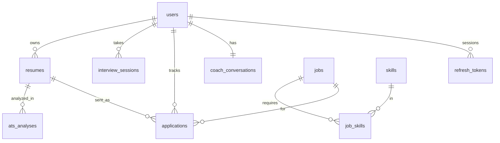

# @careerforge/database

The PostgreSQL layer for CareerForge as its own package: schema, migrations, shared validation, client factory, seed and verification. It knows nothing about Express or the frontend, and never reads `process.env` (only the CLI and seed scripts do).

```text
database/
├── package.json  tsconfig.json  drizzle.config.ts  .env.example
├── migrations/             generated SQL + meta (0000_init.sql). Commit it. Never edit an applied file
├── test/verify.mjs         applies migrations to in-memory Postgres and checks the rules
└── src/
    ├── index.ts            public API: createDatabase, every table, validation schemas, SKILL_CATALOG
    ├── client.ts           createDatabase({ connectionString }) → { db, pool }
    ├── catalog.ts          the recognised skills: one list for seed, ATS and interview scoring
    ├── schema/             one file per domain
    │   ├── users.ts  resumes.ts  ats-analyses.ts  interview-sessions.ts  applications.ts
    │   ├── coach-conversations.ts  jobs.ts  skills.ts  job-skills.ts
    │   ├── _shared.ts  _enums.ts  relations.ts  index.ts
    ├── validation/         zod contracts shared with the API (the single source of truth)
    │   └── resume-content.ts  interview.ts  application.ts  coach.ts  ats.ts  index.ts
    ├── seed/               index.ts  skills.ts  jobs.ts (12 fictional jobs)  users.ts (demo user + resume)
    └── cli/                env.ts  migrate.ts
```

## Use it
**Standalone:** `cp .env.example .env`, set `DATABASE_URL`, then `npm install && npm run migrate && npm run seed`.

**From the API** (npm workspace, see the root `package.json`):
```ts
import { createDatabase, resumes, resumeContent } from "@careerforge/database";
export const { db, pool } = createDatabase({ connectionString: process.env.DATABASE_URL! });
```
Build the package before the backend runs (`npm run build -w database`; the root `postinstall` does it, and you rerun it after schema changes). Keep one copy of `drizzle-orm` in the workspace so helpers like `eq` and `and` share types with the tables.

| Command | What it does |
|---|---|
| `npm run generate` | Diff schema into a new SQL file in `migrations/`. Read it before committing |
| `npm run migrate` | Apply pending migrations (same command locally, in CI and in production) |
| `npm run seed` | Skills catalog, 12 fictional jobs, demo user `demo@careerforge.dev` / `demo-password-123`. Refuses to run in production |
| `npm run verify` | Runs every migration on in-memory Postgres and asserts constraints and cascades. No server needed |

## The 10 tables
| Table | Holds |
|---|---|
| `users`, `refresh_tokens` | accounts; hashed, rotating session tokens |
| `resumes` | one validated JSONB `content` document + `ats_score` |
| `ats_analyses` | one row per ATS run, with `model_version` |
| `interview_sessions` | config, questions, answers, scores and feedback as one document per session |
| `applications` | kanban cards: stage, position within the column, which resume was sent |
| `coach_conversations` | one row per user: chat messages + the current learning plan |
| `jobs`, `skills`, `job_skills` | listings, the skill catalog, and the join that answers "which jobs need React?" |



## Conventions
- uuid primary keys, `timestamptz` everywhere, snake_case in SQL, camelCase in TypeScript.
- **Every user-owned table has `user_id ... ON DELETE CASCADE`** (`owner()`): deleting an account is one statement.
- Links that should outlive the other row use `SET NULL` (`applications.resume_id`, `interview_sessions.resume_id`).
- Check constraints guard 0-100 scores; enums cover small stable sets (stage, interview status, job level). Add enum values with a migration; never reorder or remove.
- Secrets (refresh tokens) are stored only as SHA-256 hashes.
- JSONB for documents, validated by the zod schemas in `validation/` at the API edge; anything filtered or sorted on is a real column. `jobs.salary_*` are annual USD.

## Indexes
`users(email)` unique · `resumes(user_id, updated_at)` · `ats_analyses(resume_id, created_at)` · `jobs` full-text GIN · `jobs(source, external_id)` unique (idempotent imports) · `job_skills(skill_id)` · `skills(lower(name))` unique · `applications(user_id, stage, position)` · `interview_sessions(user_id, started_at)` · `refresh_tokens(expires_at)` for pruning.

## Changing the schema
1. Edit `src/schema/*` (and `src/validation/*` if a JSONB shape changes). 2. `npm run generate`. 3. Read the SQL; commit it with the change. 4. `npm run migrate`, `npm run verify`, `npm run build`.
One concern per migration; never edit an applied migration (write a new one). For risky changes use **expand, then contract**: add the new column, write both, backfill, switch reads, drop the old one in a later release. New table: new file using `pk()`, `createdAt()`, `owner()`; export it from `schema/index.ts`; extend `test/verify.mjs`.

## Not here yet (add when a feature needs it)
Password-reset tokens, per-user saved jobs, readiness-score history for the dashboard trend, an audit log. Schedule deletion of expired `refresh_tokens`. Decide how long to keep `coach_conversations` and `ats_analyses.job_description` (personal text, doc 10). Hosted Postgres such as Neon: pooled URL for the API, direct URL for migrations.
