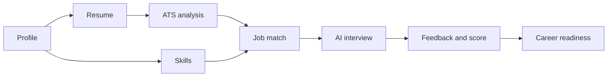

# 01. Project Overview

**Status:** v0.1 · **Owner:** Solomon (backend, product) · Frontend design and build assisted by Claude

## What CareerForge AI is
An AI career platform that treats a job search as one continuous journey instead of ten separate tools:

## Problem
Job seekers juggle a resume builder, an ATS checker, interview practice and job boards. None share context, so advice is generic and progress is invisible.

## Audience
Graduates and early-career job seekers, career switchers, and experienced professionals refreshing their applications.

## Product principles
1. **One journey.** Every feature feeds the Career Readiness score.
2. **Honest AI.** The AI never invents qualifications. It separates *missing evidence* from *skill gaps* (see doc 09).
3. **Product as hero.** Real UI, not stock photos.
4. **Calm motion.** One orchestrated moment per screen; everything honors reduced motion.
5. **Accessible by default.** Keyboard, screen reader and mobile first-class.

## Stack
| Layer | Choice |
|---|---|
| Frontend | React 18, Vite, TypeScript, Tailwind, Framer Motion, Lucide, Zustand, React Router |
| Backend | In design (see docs 07, 08, 10; all marked DRAFT) |
| AI | Provider-agnostic service layer (doc 09) |

## Scope
**In:** resume management and builder, AI rewriting, ATS analysis, AI mock interviews with feedback, job matching, career coach, application tracker.
**Out for v1:** recruiter-side tools, video/voice interviews, payments beyond a pricing page, native mobile apps.

## Glossary
- **Career Readiness:** composite 0–100 score (resume, ATS, interview, skills).
- **Missing evidence:** a skill the user may have but the resume doesn't show.
- **Skill gap:** a skill the user has not demonstrated at all.
- **Career Profile:** the single profile (Resume → Skills → Experience → Jobs → Interviews → Applications) that every feature adds to.

## Document map
| # | Doc | Status |
|---|---|---|
| 02 | Product requirements | Draft |
| 03 | UI/UX design system | Implemented in code |
| 04 | Frontend architecture | Implemented |
| 05 | User flows | Draft |
| 06 | Feature specifications | Draft |
| 07 | API specification | **Proposal, awaiting backend design** |
| 08 | Database design | **Proposal, awaiting backend design** |
| 09 | AI system design | Draft |
| 10 | Security and auth | Draft |
| 11 | Testing strategy | Draft |
| 12 | Deployment guide | Draft |
