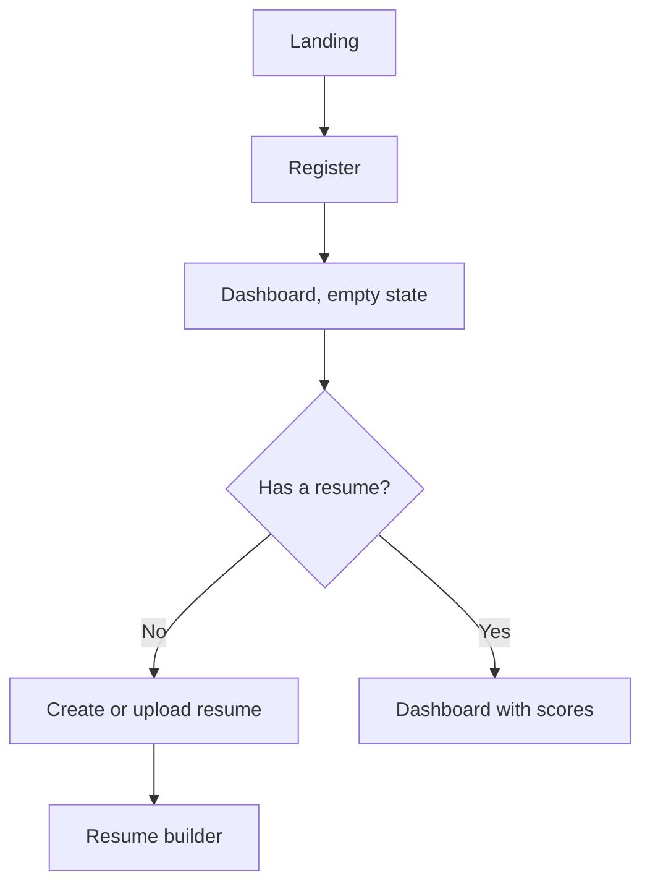
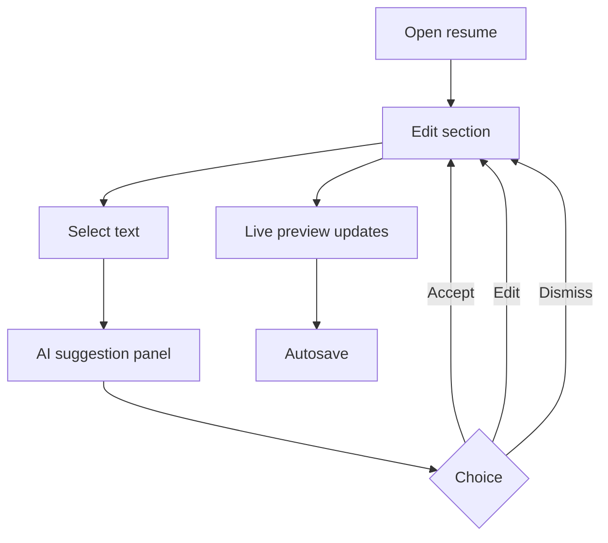
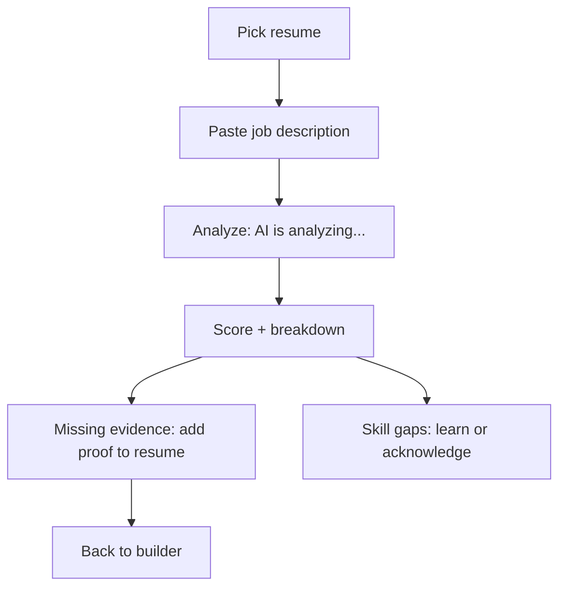
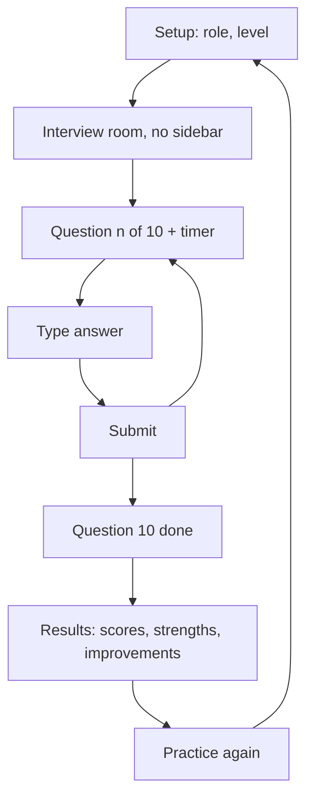

# 05. User Flows

## Onboarding

## Resume improvement

Desktop: panel slides in from the right (200–250 ms). Mobile: bottom sheet.

## ATS analysis

## AI interview

Orb states: idle while waiting, thinking while evaluating, speaking while the question is presented.

## Job matching
Search or paste job → match score per job → view required skills against user skills → save to Applications or improve resume for this job.

## Application tracking
Add application (from a job or manually) → status: saved, applied, interviewing, offer, rejected → notes and dates.

## Error and edge flows
| Case | Behavior |
|---|---|
| Session expires | Redirect to login, return to the same route after |
| AI request fails | Inline error with Retry; user's text is never lost |
| Leaving mid-interview | Confirm dialog; progress saved as draft |
| Offline | Toast explaining the action will retry; editor keeps local draft |
