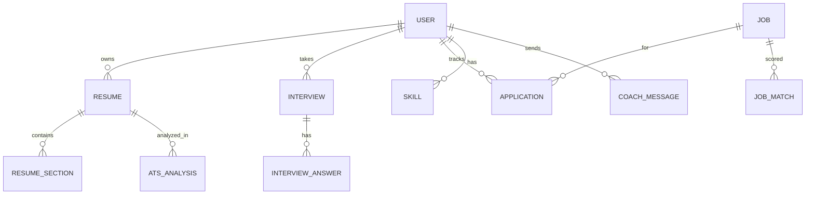

# 08. Database Design

> **DRAFT / PROPOSAL.** Assumes a relational database (PostgreSQL syntax). Adjust freely as the backend design evolves.

## Entity relationships

## Tables
| Table | Key columns |
|---|---|
| `users` | id (uuid), name, email (unique, lowercased), password_hash, avatar_url, created_at, deleted_at |
| `resumes` | id, user_id → users, title, template, score, created_at, updated_at |
| `resume_sections` | id, resume_id, type (profile, experience, education, skills, projects), position, content (jsonb) |
| `skills` | id, user_id, name, level, source (manual, resume) |
| `ats_analyses` | id, resume_id, job_description, score, breakdown (jsonb), missing_evidence (jsonb), skill_gaps (jsonb), model_version, created_at |
| `jobs` | id, title, company, location, description, skills (text[]), source, external_id |
| `job_matches` | id, user_id, job_id, resume_id, score, reasons (jsonb) |
| `interviews` | id, user_id, role, level, status (draft, active, complete), score, communication, technical, confidence, started_at, completed_at |
| `interview_questions` | id, interview_id, position, text |
| `interview_answers` | id, question_id, answer, seconds_taken, feedback (jsonb), score |
| `applications` | id, user_id, job_id nullable, company, title, status, notes, applied_at |
| `coach_messages` | id, user_id, role (user, assistant), content, created_at |
| `readiness_snapshots` | id, user_id, score, resume, ats, interview, skills, created_at |
| `audit_log` | id, user_id, action, ip, created_at |

## Indexes
`users(email)` unique; `resumes(user_id, updated_at desc)`; `ats_analyses(resume_id, created_at desc)`; `interviews(user_id, started_at desc)`; `applications(user_id, status)`; GIN on `jobs(skills)`; full-text on `jobs(title, description)`.

## Rules
- Soft-delete users first, hard-delete personal data after the retention window (doc 10).
- Resume section content is versioned JSON so the schema can evolve without migrations per field.
- Store `model_version` with every AI-derived record so scores can be explained and compared.
- `readiness_snapshots` feed the CareerProgress chart; write one after each scored event.

## Migration approach
Versioned migrations only (Flyway, Liquibase or the framework's tool), never manual schema edits; every migration reversible where possible.

## Implementation notes (decided stack)
- **PostgreSQL + Drizzle ORM.** Define the tables above as Drizzle schemas; generate versioned migrations with drizzle-kit and commit them.
- Use real foreign keys with `ON DELETE CASCADE` for user-owned data so account deletion (doc 10) is one statement.
- Hosted Postgres (for example Neon) needs a pooled connection string for the API and a direct one for migrations. Check the provider's current free-tier limits before relying on them.

## As implemented in `backend/src/db/schema.ts` (this section wins)
Built: `users`, `refresh_tokens` (SHA-256 hashed), `resumes` (one validated JSONB `content` instead of `resume_sections`), `ats_analyses` (adds `suggestions`), `interviews`, `interview_answers`, `applications`. Still to add with their routes: `jobs`, `job_matches`, `skills`, `coach_messages`, `readiness_snapshots`, `audit_log`.
