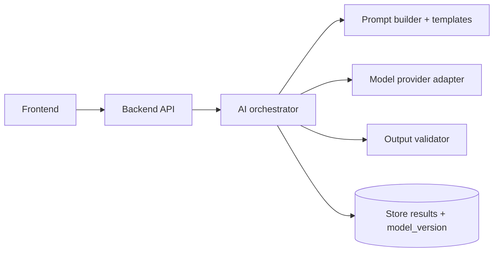

# 09. AI System Design

## Capabilities
| Capability | Input | Output |
|---|---|---|
| Rewrite | selected text + surrounding resume | suggestion with placeholders |
| ATS analysis | resume + job description | scores, keyword match, missing evidence, skill gaps |
| Interview generation | role, level, resume | question set |
| Answer evaluation | question + answer | scores, strengths, improvements |
| Job matching | resume/skills + job | score with reasons |
| Coach | conversation + user context | advice grounded in user data |

## Architecture

The **provider adapter** keeps the model swappable. The **validator** enforces JSON schemas and guardrails before anything reaches the user.

## Guardrails
1. **No fabrication.** The AI may only restate or restructure facts present in the user's data. New metrics, employers, dates, titles or credentials are forbidden; if useful, output a placeholder like `[X]%`.
2. **Evidence vs gap.** For each job requirement: found in resume → matched; plausibly implied but not shown → *missing evidence*; nowhere → *skill gap*. Never label a gap as "you have this."
3. **Untrusted inputs.** Resume text and job descriptions are data, not instructions (prompt-injection defense; doc 10).
4. **Fairness.** Do not score on name, gender, age, nationality, photo or other protected traits; strip these from scoring inputs where possible.
5. **Tone.** Specific, constructive, no invented praise.

## Scoring
| Score | Suggested composition (tune with data) |
|---|---|
| ATS | keywords 35%, experience 30%, skills 25%, formatting 10% |
| Interview | communication, technical, confidence (equal weight by default; role-dependent) |
| Readiness | resume 30%, ATS 25%, interview 30%, skills 15% |

Prefer deterministic checks (keyword extraction, formatting rules) for the parts that can be deterministic, and use the model for judgment. Scores are rubric-based with the rubric in the prompt, temperature low for repeatability.

## Structured output
All AI endpoints return JSON validated against a schema; on failure, retry once with the validation error, then return a friendly error. Streaming endpoints stream text only; structured fields arrive in a final message.

## Latency, cost, reliability
Stream rewrites and coach replies. Cache ATS results by hash(resume version + job description + model_version). Per-user quotas, timeouts, and a circuit breaker with graceful degradation ("AI is busy, your work is saved").

## Evaluation
Golden set of resumes and job descriptions with expected gap classification; regression checks on every prompt or model change; human review sample; track hallucination rate (any fact not in source) as a release gate. See doc 11.

## Privacy
Send the minimum data needed; no training on user data unless explicit consent; redact contact details from prompts when not required; log prompts without PII.

## Open questions
Provider and model choice, per-plan quotas, voice interviews later, retention period for prompts.
