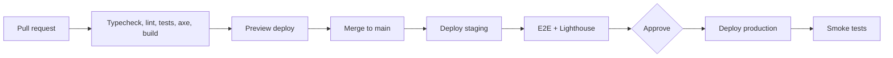

# 12. Deployment Guide

## Environments
| Env | Purpose | Data |
|---|---|---|
| local | Development | Seed or mock data |
| staging | Pre-release checks, E2E | Anonymized or synthetic only |
| production | Users | Real, backed up |

## Frontend
```bash
npm ci
npm run build        # outputs dist/
```
It is a static SPA: host `dist/` on any static host or CDN (Vercel, Netlify, Cloudflare Pages, S3 + CDN, or Nginx). Required:
- **SPA fallback:** unknown paths serve `index.html` (React Router).
- Long-cache hashed assets, `no-cache` for `index.html`.
- HTTPS, security headers from doc 10.

### Environment variables
| Var | Example | Notes |
|---|---|---|
| `VITE_API_URL` | `https://api.example.com/api/v1` | Baked in at build time. Public. No secrets. |

### Nginx example
```nginx
location / { try_files $uri /index.html; }
location /assets/ { add_header Cache-Control "public, max-age=31536000, immutable"; }
```

## Backend (fill in as the design settles)
Containerize the API; run behind a reverse proxy or load balancer with TLS; managed database with automated backups; secrets from a secrets manager; health endpoints `/health/live` and `/health/ready`; migrations run as a separate release step before new code.

## CI/CD pipeline


## Release process
1. Tag the release, changelog from merged PRs.
2. Deploy staging, run E2E and the AI golden set.
3. Backend migration first, then API, then frontend (backward-compatible changes only, so the order is safe).
4. Smoke test: login, open a resume, run an ATS analysis, start an interview.
5. Monitor for 30 minutes.

## Rollback
Frontend: redeploy the previous build (keep the last 5). Backend: roll back the image; use expand/contract migrations so rollback doesn't need a schema reversal. Feature flags for risky features (AI changes especially).

## Observability
- Frontend: error tracking (Sentry or similar) with source maps uploaded privately, Web Vitals.
- Backend: structured logs, request tracing, metrics (latency, error rate, AI latency and cost per request), alerts to on-call.
- Uptime checks on landing, `/health/ready`, and one AI endpoint.

## Backups and recovery
Daily database backups plus point-in-time recovery, encrypted, restore tested quarterly. Define RPO and RTO before launch (proposal: RPO 15 min, RTO 1 h).

## Launch checklist
- [ ] `VITE_API_URL` correct per env
- [ ] SPA fallback and cache headers verified
- [ ] CORS allows only the real frontend origin
- [ ] Security checklist in doc 10 complete
- [ ] Rate limits and AI spend caps active
- [ ] Error tracking and alerts working
- [ ] Backup restore tested
- [ ] Privacy policy, terms and account deletion available

## Backend hosting (decided stack)
Candidate setup: API on Railway (or Render/Fly.io), PostgreSQL on Neon. Free tiers and trial credits change often, so confirm current limits and sleep behavior before sharing a public link. Required env vars: `DATABASE_URL`, `JWT_SECRET` (or cookie secret), `FRONTEND_ORIGIN`, `ANTHROPIC_API_KEY` (or the chosen provider's key). Never commit them. Run `npm run db:migrate` (the `database` package) as a release step before starting the new API version.

## Backend build order
1. `GET /health` returns `{ ok: true }`. 2. Postgres + Drizzle schema + first migration. 3. Register/login with hashed passwords and token middleware. 4. Resumes CRUD scoped by `user_id`. 5. `/rewrite` streaming proxy. 6. ATS, interviews, jobs, applications, coach. After each step, switch the matching `services/*.api.ts` and run its E2E journey (doc 11).
